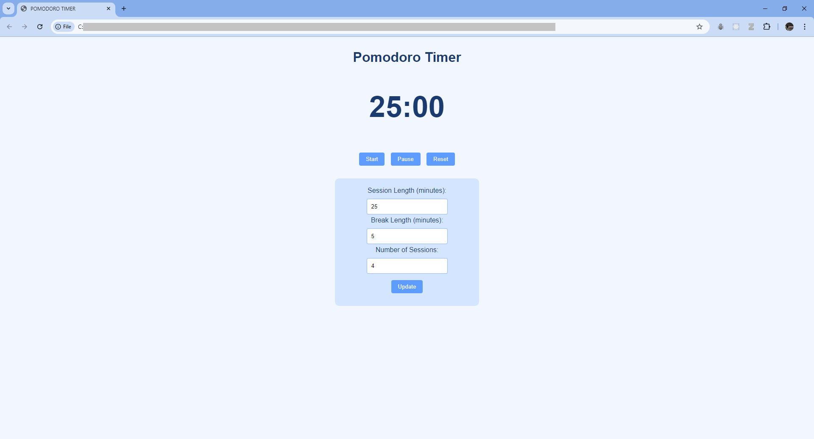

# Pomodoro_Timer
A Pomodoro Timer using HTML, CSS and JavaScript.

Web-App Link: https://s1997aniket.github.io/Pomodoro_Timer/

## Description:
- Set the 'Session Length', the 'Break Length' and the 'Number of Sessions'.
- 'Start', 'Pause' or 'Reset' the timer if required.
- Try out the timer using the link provided above.

## Snapshots:

1. Using the Timer:

